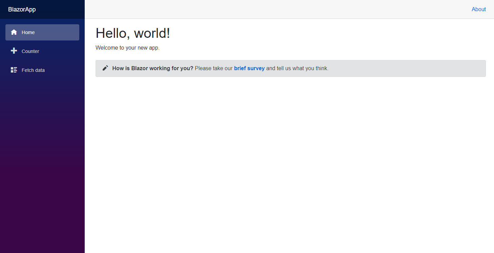
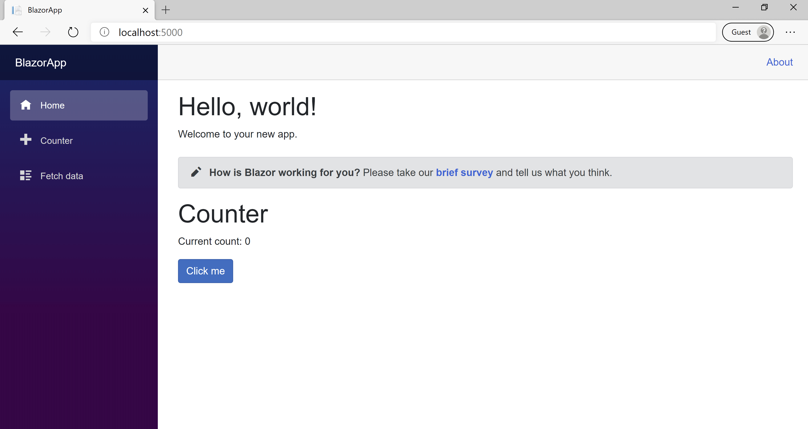

## 创建一个Blazor 程序

``` bash
dotnet new blazorserver -o BlazorApp --no-https
```

接着，切换到该目录.

``` bash
cd BlazorApp
```

### 解析

The dotnet new command creates a new application.
`dotnet new` 命令用于创建一个新的应用。

- `Program.cs` 是程序入口，用于启动程序
- `Startup.cs` 用于存放服务和中间件的配置
- `App.razor` 是应用的 Root Component
- `BlazorApp/Pages` 包含了一些示例页面代码
- `BlazorApp.csproj` 定义了项目的库的应用


## 让他跑起来

在命令行，输入一下命令

``` bash
dotnet run
```



显示的页面通过`Pages/Index.razor`定义，内容如下
``` html
@page "/"

<h1>Hello, world!</h1>

Welcome to your new app.

<SurveyPrompt Title="How is Blazor working for you?" />
```

## 尝试Counter

点击`Counter ` 跳转至counter页面，如下图所示


选择 **Click me** 可以在不刷新页面的情况下增加技术其. 在页面上增加计数器通常需要JavaScript，但是在Blazor中你可以使用C#.

你可以在`Pages/Counter.razor`找到 `Counter` 空间的实现 .

```html
@page "/counter"

<h1>Counter</h1>

<p>Current count: @currentCount</p>

<button class="btn btn-primary" @onclick="IncrementCount">Click me</button>

@code {
    private int currentCount = 0;

    private void IncrementCount()
    {
        currentCount++;
    }
}
```

每次在**Click me**按钮点击之后

- onclick事件会被触发
- `IncrementCount` 方法会被调用
- 变量`currentCount`会增加
- 组件会显示更新之后的值

## 添加一个组件

每个.razor文件定义的UI组件都可以被重用

使用文本编辑器打开`Index.razor`. 添加一个counter组件

```html
@page "/"

<h1>Hello, world!</h1>

Welcome to your new app.

<SurveyPrompt Title="How is Blazor working for you?" />

<Counter />
```

保存后，按下`ctrl+C`退出应用，再重新输入`dotnet run`



## 修改一个组件

组件参数可以用于向子组件传递参数

- 添加一个名为 `IncrementAmount` 的 property 并添加 `[Parameter]` attribute.
- 改变 `IncrementCount` 方法.

```c#
@page "/counter"

<h1>Counter</h1>

<p>Current count: @currentCount</p>

<button class="btn btn-primary" @onclick="IncrementCount">Click me</button>

@code {
    private int currentCount = 0;

    [Parameter]
    public int IncrementAmount { get; set; } = 1;

    private void IncrementCount()
    {
       currentCount += IncrementAmount;
    }
}

```

使用文本编辑器打开`Index.razor`. 在`Counter`组件中添加`IncrementAmount`字段

```  c#
@page "/"

<h1>Hello, world!</h1>

Welcome to your new app.

<SurveyPrompt Title="How is Blazor working for you?" />

<Counter IncrementAmount="10" />
```

重新启动应用

