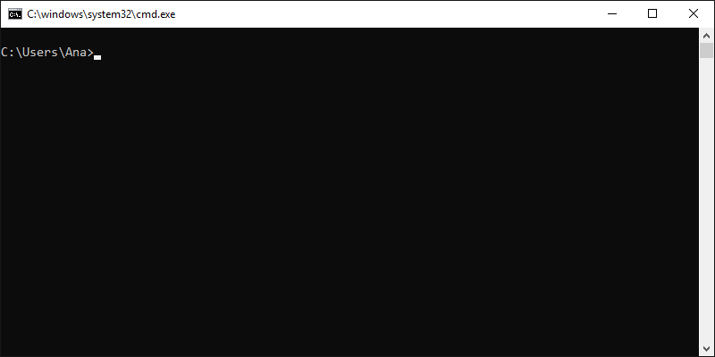

## 创建一个命令行程序

``` bash
dotnet new console -o fisrtapp
```

接着，切换到该目录.

``` bash
cd fisrtapp
```

### 解析

1. `dotnet new console` 会创建一个命令行程序
2. `-o` 参数表示创建一个新的目录`fisrtapp` ,该目录会保存项目相关的文件
3. `cd fisrtapp` 表示切换当前目录到你创建的那个目录



项目主文件为`Program.cs` 默认情况下，他会输出“Hello World” 到命令行。


``` c#
using System;

namespace myApp
{
    class Program
    {
        static void Main(string[] args)
        {
            Console.WriteLine("Hello World!");
        }
    }
}
```


## 让他跑起来

在命令行，输入一下命令

``` bash
dotnet run
```

恭喜你，你创建了第一个.NET程序


## 编辑代码

通过任意文件编辑器，例如Notepad 或者 Visual Studio Code。

``` c#
using System;

namespace myApp
{
    class Program
    {
        static void Main(string[] args)
        {
            Console.WriteLine("Hello World!");
            Console.WriteLine("The current time is " + DateTime.Now);
        }
    }
}
```

保存`Program.cs`并执行

``` bash
dotnet run
```

如果成功，你会看到以下内容

``` bash
Hello World!
The current time is 11/10/2020 8:00:00 AM
```

