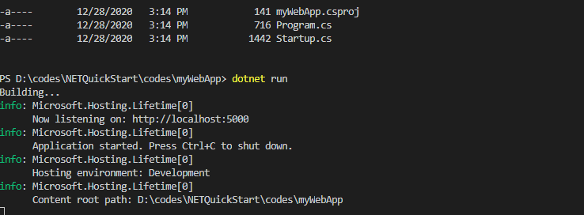
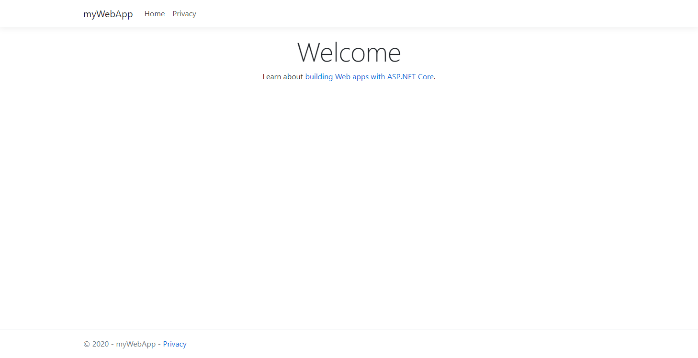
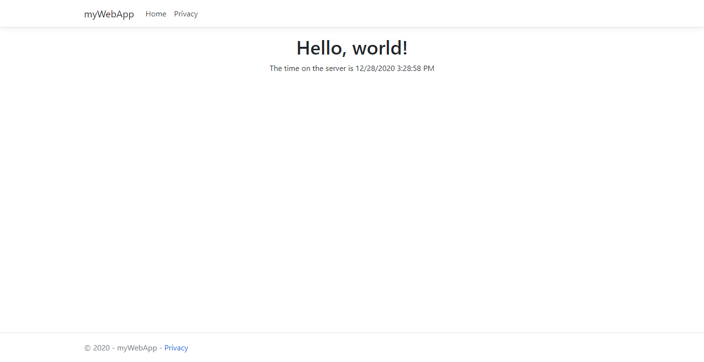

## 创建一个web程序

``` bash
dotnet new webApp -o myWebApp --no-https
```

接着，切换到该目录.

``` bash
cd myWebApp
```

### 解析

The dotnet new command creates a new application.
`dotnet new` 命令用于创建一个新的应用。

1. `webApp` 是新创建应用模板的参数。
2. `-o` 参数表示创建一个新的目录`myWebApp` ,该目录会保存项目相关的文件
3. `--no-https` 表示该应用不启用https
4. `cd myWebApp` 表示进入你新建的应用.

该命令会为你创建一个最简单的web应该，相关文件会放在myWebApp目录下

Startup.cs 包含了所有的配置
myWebApp/Pages directory 包含了一些测试页面代码
myWebApp.csproj 定义了项目的库的应用

## 让他跑起来

在命令行，输入一下命令

``` bash
dotnet run
```
成功后，打你会看到一下图片



此时打开浏览器并输入 `http://localhost:5000`



## 编辑代码

通过任意文件编辑器编辑 `Pages/Index.cshtml`，例如Notepad 或者 Visual Studio Code。

```html
@page
@model IndexModel
@{
    ViewData["Title"] = "Home page";
}

<div class="text-center">
    <h1>Hello, world!</h1>
    <p>The time on the server is @DateTime.Now</p>
</div>
```

保存后，按下`ctrl+C`退出应用，再重新输入`dotnet run`


如果成功，你会看到以下内容



