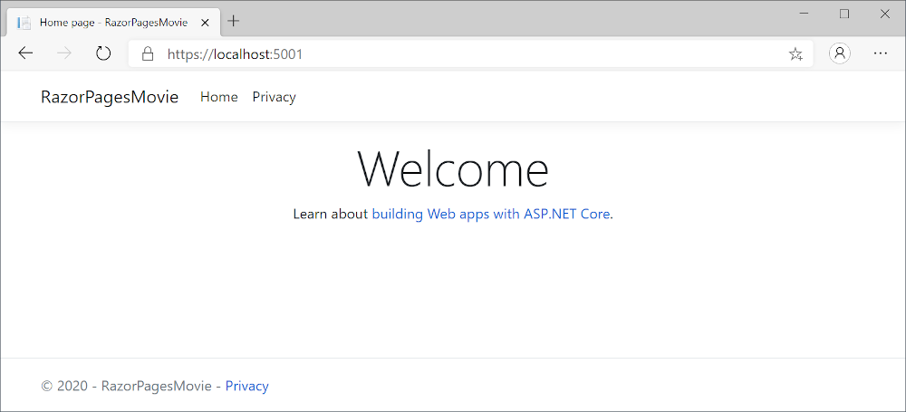
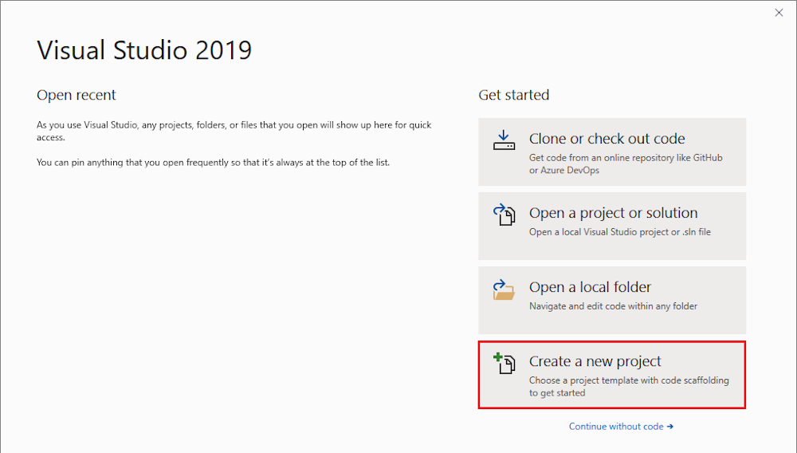
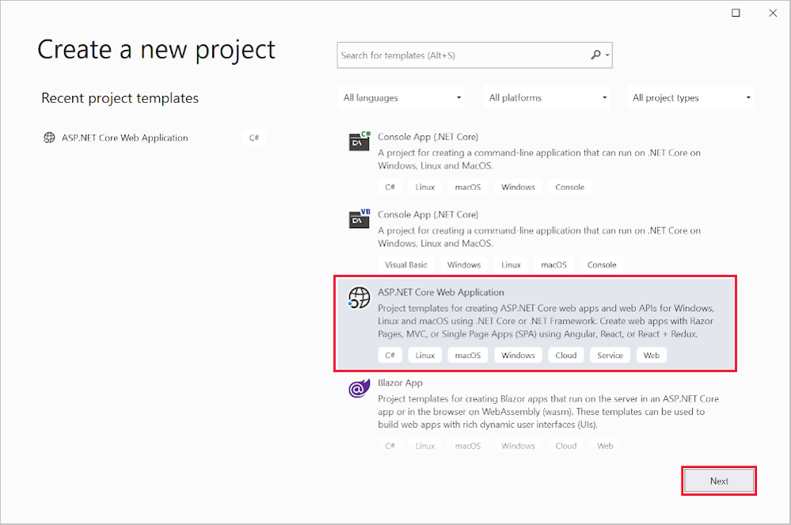
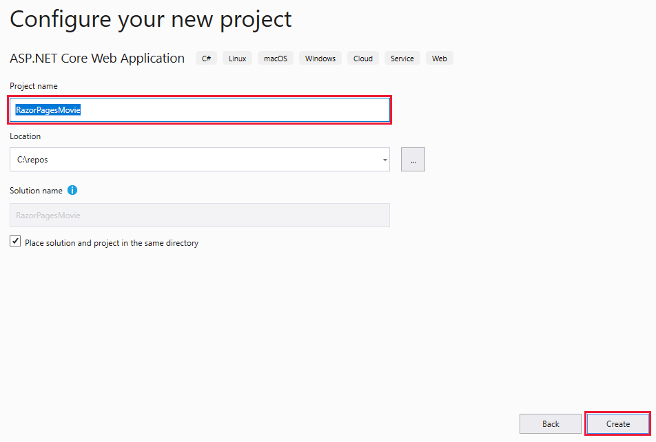
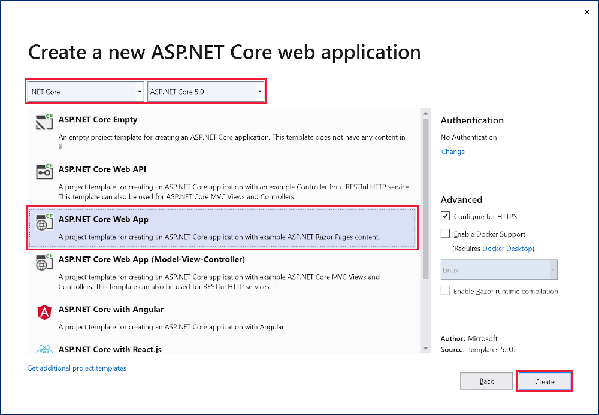
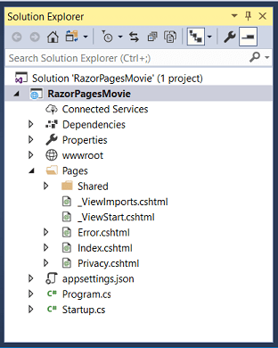

本教程是系列教程中的第一个教程，介绍生成 ASP.NET Core Razor 页面 Web 应用的基础知识。

在本系列结束时，你将拥有一个管理电影数据库的应用。  

[查看或下载示例代码](https://github.com/dotnet/AspNetCore.Docs/tree/master/aspnetcore/tutorials/razor-pages/razor-pages-start/sample/RazorPagesMovie50)。

在本教程中，你将了解：

> * 创建 Razor 页面 Web 应用。
> * 运行应用。
> * 检查项目文件。

在本教程结束时，你将有一个工作的 Razor Pages Web 应用。在后续教程中，你可以在其基础上进行增强。



1. 启动 Visual Studio 并选择“创建新项目”.
   

1. 在“创建新项目”对话框中，选择“ASP.NET Core Web 应用程序”，然后选择“下一步”  。

    
    
1. 在“配置新项目”对话框中，为“项目名称”输入 `RazorPagesMovie`。 请务必将项目命名为“RazorPagesMovie”（包括匹配大小写），这样在复制和粘贴代码时命名空间就会匹配。

1. 选择“创建”  。

    

1. 在“创建新的 ASP.NET Core Web 应用程序”对话框中，选择：
    1. 下拉列表中的“.NET Core”和“ASP.NET Core 5.0”。
    1. **Web 应用程序**。
    1. **Create**。

     

    创建以下初学者项目：

    

# <a name="visual-studio-code"></a>[Visual Studio Code](#tab/visual-studio-code)

1. 打开[集成终端](https://code.visualstudio.com/docs/editor/integrated-terminal)。

1. 更改为将包含项目的目录 (`cd`)。

1. 运行以下命令：

   ```dotnetcli
   dotnet new webapp -o RazorPagesMovie
   code -r RazorPagesMovie
   ```

   * `dotnet new` 命令在“RazorPagesMovie”文件夹中新建 Razor Pages 项目。
   * `code` 命令在 Visual Studio Code 的当前实例中打开“RazorPagesMovie”文件夹。

---


## <a name="examine-the-project-files"></a>检查项目文件

下面是主项目文件夹和文件的概述，将在后续教程中使用。

### <a name="pages-folder"></a>Pages 文件夹

包含 Razor 页面和支持文件。 每个 Razor 页面都是一对文件：

* 一个 .cshtml 文件，其中包含使用 Razor 语法的 C# 代码的 HTML 标记。
* 一个 .cshtml.cs 文件，其中包含处理页面事件的 C# 代码。

支持文件的名称以下划线开头。 例如，_Layout.cshtml 文件可配置所有页面通用的 UI 元素。 此文件设置页面顶部的导航菜单和页面底部的版权声明。 有关详细信息，请参阅 [ASP.NET Core 中的布局](https://docs.microsoft.com/zh-cn/aspnet/core/mvc/views/layout?view=aspnetcore-5.0)。

### <a name="wwwroot-folder"></a>wwwroot 文件夹

包含静态资产，如 HTML 文件、JavaScript 文件和 CSS 文件。 有关详细信息，请参阅 [ASP.NET Core 中的静态文件](https://docs.microsoft.com/zh-cn/aspnet/core/fundamentals/static-files?view=aspnetcore-5.0)。

### appsettings.json

包含配置数据，如连接字符串。 有关详细信息，请参阅 [ASP.NET Core 中的配置](https://docs.microsoft.com/zh-cn/aspnet/core/fundamentals/configuration/?view=aspnetcore-5.0)。

### <a name="programcs"></a>Program.cs

包含应用的入口点。 有关详细信息，请参阅 [ASP.NET Core 中的 .NET 通用主机](https://docs.microsoft.com/zh-cn/aspnet/core/fundamentals/host/generic-host?view=aspnetcore-5.0)。

### <a name="startupcs"></a>Startup.cs

包含配置应用行为的代码。 有关详细信息，请参阅 [ASP.NET Core 中的应用启动](https://docs.microsoft.com/zh-cn/aspnet/core/fundamentals/startup?view=aspnetcore-5.0)。

* [本教程的 YouTube 版本](https://www.youtube.com/watch?v=F0SP7Ry4flQ&feature=youtu.be)
